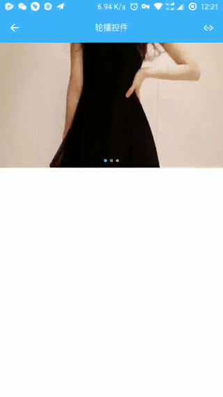

# weiui_banner

> `<weiui_banner>` 是一个轮播控件，支持无限循环，支持任意组件。

## 子组件

支持包括 `<div>` 在内的任何组件作为自己的子组件。因此，在写一个组件时，推荐外层使用 `<div>` 作为根容器。

## 预览效果



## 示例代码

```vue
<template>
    <div class="app">

        <weiui_banner class="banner" @itemClick="itemClick">
            <div class="banner-frame" v-for="img in imageList">
                <image class="banner-image" resize="cover" :src="img.src"></image>
            </div>
        </weiui_banner>

    </div>
</template>

<style scoped>
    .app {
        width: 750px;
        flex: 1;
    }

    .banner {
        width: 750px;
        height: 420px;
    }

    .banner-frame {
        width: 750px;
        height: 420px;
        position: relative;
    }

    .banner-image {
        width: 750px;
        height: 420px;
    }

</style>

<script>
    const weiui = weex.requireModule('weiui');

    export default {
        data() {
            return {
                imageList: [
                    { src: 'https://gd2.alicdn.com/bao/uploaded/i2/T14H1LFwBcXXXXXXXX_!!0-item_pic.jpg'},
                    { src: 'https://gd1.alicdn.com/bao/uploaded/i1/TB1PXJCJFXXXXciXFXXXXXXXXXX_!!0-item_pic.jpg'},
                    { src: 'https://gd3.alicdn.com/bao/uploaded/i3/TB1x6hYLXXXXXazXVXXXXXXXXXX_!!0-item_pic.jpg'}
                ]
            }
        },

        methods: {
            itemClick(res) {
                weiui.toast("点击" + (res.position + 1) + "项")
            }
        }
    };
</script>
```


## 配置参数 `weiui`
>说明：ui自定义；数据格式：对象数据。

| 属性名           | 类型     | 描述                          | 默认值     |
| ------------- | ------ | -------------------------- | ------- |
| autoPlayDuration |`Number`  | 设置切换间隔时间，单位：毫秒           | 6000      |
| scrollDuration |`Number`  | 设置切换过程时间，单位：毫秒           | 900     |
| indicatorShow |`Boolean`  | 是否显示指示器           | true     |
| indicatorShape |`Number`  | 设置指示器形状：<br/>`0`: 矩形、`1`: 圆形           | 1       |
| indicatorPosition |`Number`  | 设置指示器位置：<br/>`0`: 中下、`1`: 右下、`2`: 左下<br/>`3`: 中上、`4`: 右上、`5`: 左上           | 0       |
| indicatorMargin |`Number`  | 设置指示器边缘距离           | 8      |
| indicatorSpace |`Number`  | 设置指示器间距           | 3       |
| selectedIndicatorColor |`String`  | 设置指示器已选颜色           | #3EB4FF       |
| unSelectedIndicatorColor |`String`  | 设置指示器未选颜色           | #99ffffff      |
| indicatorWidth |`Number`  | 设置指示器宽           | 6      |
| indicatorHeight |`Number`  | 设置指示器高           | 6      |

> 例如：

```vue
<weiui_banner 
    ref="reflectName"
    class="banner" 
    :weiui="{autoPlayDuration:3000}"></weiui_banner>
```

## 事件回调 `callback`

``` js
/**
 * 组件加载完成
 */
@ready = function() { ... }

/**
 * 项目点击事件
 * 返回参数：data = {
                    position: 1     //点击项目的序号
                }
 */
@itemClick = function(data) { ... }

/**
 * 项目长按事件
 * 返回参数：data = {position: 1}
 */
@itemLongClick = function(data) { ... }
```

## 调用方法 `methods`

```js
/**
 * 开始自动轮播，默认自动开始
 */
this.$refs.reflectName.startAutoPlay();

/**
 * 停止自动轮播
 */
this.$refs.reflectName.stopAutoPlay();

/**
 * 设置切换间隔时间
 * 参数一：毫秒
 */
this.$refs.reflectName.setAutoPlayDuration(6000);

/**
 * 设置切换过程时间
 * 参数一：毫秒
 */
this.$refs.reflectName.setScrollDuration(900);

/**
 * 设置是否显示指示器
 * 参数一：true|false
 */
this.$refs.reflectName.setIndicatorShow(true);

/**
 * 设置指示器形状
 * 参数一：0-1，详细看weiui.indicatorShape参数
 */
this.$refs.reflectName.setIndicatorShape(0);

/**
 * 设置指示器位置
 * 参数一：0-5，详细看weiui.indicatorPosition参数
 */
this.$refs.reflectName.setIndicatorPosition(0);

/**
 * 设置指示器边缘距离
 * 参数一：边缘距离
 */
this.$refs.reflectName.setIndicatorMargin(8);

/**
 * 设置指示器间距
 * 参数一：间距
 */
this.$refs.reflectName.setIndicatorSpace(3);

/**
 * 设置指示器已选颜色
 * 参数一：颜色代码
 */
this.$refs.reflectName.setSelectedIndicatorColor('#3EB4FF');

/**
 * 设置指示器未选颜色
 * 参数一：颜色代码
 */
this.$refs.reflectName.setUnSelectedIndicatorColor('#99ffffff');

/**
 * 设置指示器宽
 * 参数一：宽
 */
this.$refs.reflectName.setIndicatorWidth(6);

/**
 * 设置指示器高
 * 参数一：高
 */
this.$refs.reflectName.setIndicatorHeight(6);
```


