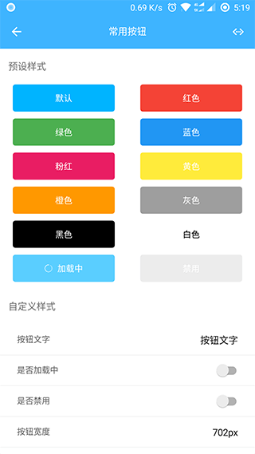

# weiui_button

> `<weiui_button>` 是一个预设常用按钮。

## 子组件

无

## 预览效果



## 示例代码

```vue
<template>
    <div class="app">
    
        <weiui_list class="list" :weiui="{pullTips: false}">

            <text class="list-title">预设样式</text>

            <div class="list-item">
                <weiui_button class="button" :weiui="{text:'默认'}"></weiui_button>
                <weiui_button class="button" :weiui="{text:'红色', model:'red'}"></weiui_button>
            </div>

            <div class="list-item">
                <weiui_button class="button" :weiui="{text:'绿色', model:'green'}"></weiui_button>
                <weiui_button class="button" :weiui="{text:'蓝色', model:'blue'}"></weiui_button>
            </div>

            <div class="list-item">
                <weiui_button class="button" :weiui="{text:'粉红', model:'pink'}"></weiui_button>
                <weiui_button class="button" :weiui="{text:'黄色', model:'yellow'}"></weiui_button>
            </div>

            <div class="list-item">
                <weiui_button class="button" :weiui="{text:'橙色', model:'orange'}"></weiui_button>
                <weiui_button class="button" :weiui="{text:'灰色', model:'gray'}"></weiui_button>
            </div>

            <div class="list-item">
                <weiui_button class="button" :weiui="{text:'黑色', model:'black'}"></weiui_button>
                <weiui_button class="button" :weiui="{text:'白色', model:'white'}"></weiui_button>
            </div>

            <div class="list-item">
                <weiui_button class="button" :weiui="{text:'加载中', loading:true}"></weiui_button>
                <weiui_button class="button" :weiui="{text:'禁用', disabled:true}"></weiui_button>
            </div>

            <text class="list-title">自定义样式</text>

            <div class="list-input-item">
                <text class="cell">按钮文字</text>
                <input class="input" placeholder="文字"
                       :value="text" @input="text=$event.value"/>
            </div>

            <div class="list-input-item">
                <text class="cell" style="flex:1">是否加载中</text>
                <switch class="switch" :checked="loading2" @change="loading2 = !loading2"></switch>
            </div>

            <div class="list-input-item">
                <text class="cell" style="flex:1">是否禁用</text>
                <switch class="switch" :checked="disabled" @change="disabled = !disabled"></switch>
            </div>

            <div class="list-input-item">
                <text class="cell">按钮宽度</text>
                <input class="input" placeholder="自定义样式实现, 默认全屏"
                       :value="width" @input="width=$event.value"/>
            </div>

            <div class="list-input-item">
                <text class="cell">按钮高度</text>
                <input class="input" placeholder="自定义样式实现, 默认高度80px"
                       :value="height" @input="height=$event.value"/>
            </div>

            <div class="list-input-item">
                <text class="cell">背景颜色</text>
                <input class="input" placeholder="自定义样式实现"
                       :value="backgroundColor" @input="backgroundColor=$event.value"/>
            </div>

            <div class="list-input-item">
                <text class="cell">边框颜色</text>
                <input class="input" placeholder="自定义样式实现"
                       :value="borderColor" @input="borderColor=$event.value"/>
            </div>

            <div class="list-input-item">
                <text class="cell">边框圆角</text>
                <input class="input" placeholder="自定义样式实现,默认8px"
                       :value="borderRadius" @input="borderRadius=$event.value"/>
            </div>

            <div class="demo-item">
                <weiui_button class="demoButton"
                              :style="{width, height}"
                              :weiui="demoStyle"></weiui_button>
            </div>

        </weiui_list>


    </div>
</template>

<style scoped>
    .app {
        width: 750px;
        flex: 1;
        background-color: #ffffff;
    }

    .list {
        width: 750px;
        flex: 1;
    }

    .list-title {
        margin-top: 24px;
        margin-bottom: 12px;
        padding-top: 36px;
        padding-right: 24px;
        padding-bottom: 24px;
        padding-left: 24px;
        font-size: 28px;
        color: #757575;
    }

    .list-item {
        width: 750px;
        flex-direction: row;
    }

    .button {
        margin-left: 37.5px;
        margin-right: 37.5px;
        margin-bottom: 20px;
        width: 300px;
        height: 80px;
        background-color: #00B4FF;
    }

    .list-input-item {
        width: 750px;
        height: 90px;
        flex-direction: row;
        align-items: center;
        border-bottom-color: #e4e4e4;
        border-bottom-style: solid;
        border-bottom-width: 1px;
    }

    .cell {
        padding-left: 50px;
        font-size: 24px;
        color: #666666;
    }

    .switch {
        padding-right: 35px;
    }

    .input {
        padding-right: 50px;
        flex: 1;
        height: 90px;
        text-align: right;
        font-size: 28px;
    }

    .demo-item {
        width: 750px;
        padding-top: 30px;
        padding-bottom: 30px;
        align-items: center;
    }

</style>

<script>
    const weiui = weex.requireModule('weiui');

    export default {
        data() {
            return {
                loading: false,

                text: '按钮文字',
                width: '702px',
                height: '80px',
                loading2: false,
                disabled: false,
                backgroundColor: '#FF5000',
                borderColor: '#FF5000',
                borderRadius: '8px',
                fontSize: '36px',
                color: '#FFFFFF'
            }
        },
        mounted() {
            setTimeout(() => {
                this.loading = true;
            }, 3000);
        },
        computed: {
            demoStyle() {
                const { backgroundColor, borderColor, borderRadius, text, color, loading2, disabled } = this;
                const customStyle = {};
                if (backgroundColor) {
                    customStyle.backgroundColor = backgroundColor;
                }
                if (borderColor) {
                    customStyle.borderColor = borderColor;
                    customStyle.borderWidth = "1px";
                }
                if (borderRadius) {
                    customStyle.borderRadius = borderRadius;
                }
                if (text) {
                    customStyle.text = text;
                }
                if (color) {
                    customStyle.color = color;
                }
                customStyle.loading = loading2;
                customStyle.disabled = disabled;
                return customStyle;
            }
        },
        methods: {}
    };
</script>
```


## 配置参数 `weiui`
>说明：ui自定义；数据格式：对象数据。

| 属性名           | 类型     | 描述                          | 默认值     |
| ------------- | ------ | -------------------------- | ------- |
| text |`String`  | 按钮文字           | -      |
| color |`String`  | 按钮文字颜色           | #FFFFFF      |
| fontSize |`Number`  | 字体大小           | -       |
| backgroundColor |`String`  | 按钮背景颜色           | #3EB4FF       |
| borderRadius |`Number`  | 圆角半径           | 8       |
| borderWidth |`Number`  | 边框大小           | 0       |
| borderColor |`String`  | 边框颜色           | -      |
| disabled |`Boolean`  | 是否禁用           | false      |
| loading |`Boolean`  | 是否加载中           | false      |
| model |`String`  | 预设风格，详细注①           | -      |

> 注①

`red`：红色；`green`：绿色；`blue`：蓝色；`pink`：粉红；

`yellow`：黄色；`orange`：橙色；`gray`：灰色；`black`：黑色；`white`：白色；

> 例如：

```vue
<weiui_button 
    ref="reflectName"
    class="button" 
    :weiui="{text:'红色', model:'red'}"></weiui_button>
```

## 事件回调 `callback`

``` js
/**
 * 组件加载完成
 */
@ready = function() { ... }
```

## 调用方法 `methods`

```js
/**
 * 设置按钮文字
 * 参数一：按钮文字
 */
this.$refs.reflectName.setText('文字');

/**
 * 设置按钮文字颜色
 * 参数一：颜色代码
 */
this.$refs.reflectName.setTextColor('#FF0000');

/**
 * 设置按钮字体大小
 * 参数一：字体大小
 */
this.$refs.reflectName.setTextSize(20);

/**
 * 设置按钮风格
 * 参数一：风格
 */
this.$refs.reflectName.setModel('red');

/**
 * 设置圆角半径
 * 参数一：半径值
 */
this.$refs.reflectName.setRadius(15);

/**
 * 设置背景颜色
 * 参数一：颜色代码
 */
this.$refs.reflectName.setBackgroundColor('#FF0000');

/**
 * 设置边框
 * 参数一：边框尺寸
 * 参数二：颜色代码
 */
this.$refs.reflectName.setBorder(2, '#00ff00');

/**
 * 设置是否禁用
 * 参数一：true|false
 */
this.$refs.reflectName.setDisabled(true);

/**
 * 设置是否加载中
 * 参数一：true|false
 */
this.$refs.reflectName.setLoading(true);
```


