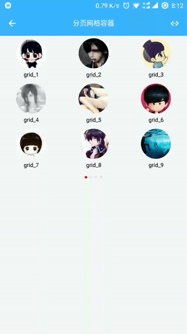

# weiui_grid

> `<weiui_grid>` 是一个分页网格容器。

## 子组件

支持包括 `<div>` 在内的任何组件作为自己的子组件。因此，在写一个组件时，推荐外层使用 `<div>` 作为根容器。

## 预览效果



## 示例代码

```vue
<template>
    <div class="app">

        <weiui_grid class="grid">

            <div class="grid-item" v-for="item in gridLists">
                <image class="item-image" resize="cover"
                       :src="'http://kuaifan.vip/weiui/assets/grid/' + item + '.jpg'"></image>
                <text class="item-title">{{item}}</text>
            </div>

        </weiui_grid>

    </div>
</template>

<style>
    .app {
        width: 750px;
        flex: 1;
    }

    .grid {
        width: 750px;
        height: 570px;
    }

    .grid-item {
        width: 250px;
        height: 180px;
        align-items: center;
    }

    .item-image {
        margin-top: 10px;
        width: 120px;
        height: 120px;
        border-radius: 90px;
    }

    .item-title {
        width: 250px;
        height: 50px;
        line-height: 50px;
        text-align: center;
    }
</style>

<script>
    const weiui = weex.requireModule('weiui');

    export default {
        data() {
            return {
                gridLists: ["grid_1", "grid_2", "grid_3", "grid_4", "grid_5", "grid_6", "grid_7", "grid_8", "grid_9", "grid_10", "grid_11", "grid_12", "grid_13", "grid_14", "grid_15", "grid_16", "grid_17", "grid_18", "grid_19", "grid_20", "grid_21", "grid_22", "grid_23", "grid_24", "grid_25", "grid_26", "grid_27", "grid_28", "grid_29", "grid_30", "grid_31", "grid_32"],
            }
        }
    };
</script>
```


### 配置参数 `weiui`
>说明：ui自定义；数据格式：对象数据。

| 属性名           | 类型     | 描述                          | 默认值     |
| ------------- | ------ | -------------------------- | ------- |
| row |`Number`  | 设置每页行数           | 3       |
| columns |`Number`  | 设置每页列数           | 3       |
| divider |`Boolean`  | 设置是否显示分隔线           | true       |
| dividerColor |`String`  | 设置分隔线颜色           | #E8E8E8       |
| dividerWidth |`Number`  | 设置分隔线尺寸           | 1      |
| indicator |`Boolean`  | 设置是否显示指示器           | true      |
| indicatorUnSelectedColor |`String`  | 设置指示器未选颜色           | #E0E0E0       |
| indicatorSelectedColor |`String`  | 设置指示器已选颜色           | #FF0000      |
| indicatorWidth |`Number`  | 设置指示器宽度           | 6      |
| indicatorHeight |`Number`  | 设置指示器高度           | 6      |

> 例如：

```vue
<weiui_grid
    ref="reflectName"
    :weiui="{
        row: 3,
        columns: 3
    }"></weiui_grid>
```

### 事件回调 `callback`

``` js
/**
 * 项目点击事件
 * 返回参数：data = {
                    page:0,         //点击项目所在页数
                    position: 1     //点击项目所在页的序号
                }
 */
@itemClick = function(data) { ... }

/**
 * 项目长按事件
 * 返回参数：data = {page:0, position: 1}
 */
@itemLongClick = function(data) { ... }
```

### 调用方法 `methods`

```js
/**
 * 设置每页行数
 * 参数一：每页行数
 */
this.$refs.reflectName.setRowSize(row);

/**
 * 设置每页列数
 * 参数一：每页列数
 */
this.$refs.reflectName.setColumnsSize(columns);

/**
 * 设置是否显示分隔线
 * 参数一：true|false
 */
 this.$refs.reflectName.setDivider(true);

/**
 * 设置分隔线颜色
 * 参数一：分隔线颜色
 */
this.$refs.reflectName.setDividerColor(color);

/**
 * 设置分隔线尺寸
 * 参数一：分隔线尺寸
 */
this.$refs.reflectName.setDividerWidth(width);

/**
 * 设置当前页
 * 参数一：页码
 */
this.$refs.reflectName.setCurrentIndex(index);

/**
 * 获取当前页
 * 返回：当前页码
 */
let variable = this.$refs.reflectName.getCurrentIndex();

/**
 * 设置是否显示指示器
 * 参数一：true|false
 */
 this.$refs.reflectName.setIndicator(true);

/**
 * 设置指示器未选颜色
 * 参数一：指示器未选颜色
 */
this.$refs.reflectName.setIndicatorUnSelectedColor(color);

/**
 * 设置指示器已选颜色
 * 参数一：指示器未选颜色
 */
this.$refs.reflectName.setIndicatorSelectedColor(color);

/**
 * 设置指示器宽度
 * 参数一：宽度
 */
this.$refs.reflectName.setIndicatorWidth(width);

/**
 * 设置指示器高度
 * 参数一：高度
 */
this.$refs.reflectName.setIndicatorHeight(height);
```


