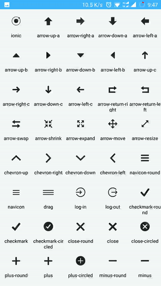

# weiui_icon

> 使用开源字体库 [Ionicons](http://ionicons.com/)、  [Iconfont+](http://www.iconfont.cn/)进行封装

## 子组件

不支持子组件。

## 预览效果



## 示例代码

```vue
<template>
    <weiui_recyler class="lists" :weiui="{ row: 5, pullTipsNo: '' }">

        <div v-for="item in iconLists" class="item" @click="copyIcon(item)">
            <weiui_icon class="icon" :weiui="{ text: item, textSize: 20 }"></weiui_icon>
            <text class="text">{{item}}</text>
        </div>

    </weiui_recyler>
</template>

<style>
    .lists {
        width: 750px;
        flex: 1;
    }
    .item {
        width: 150px;
        height: 160px;
    }
    .icon {
        width: 150px;
        height: 110px;
    }
    .text {
        width: 150px;
        height: 50px;
        text-align: center;
    }
</style>

<script>
    const weiui = weex.requireModule('weiui');

    export default {
        data() {
            return {
                iconLists: [
                    'ionic', 'arrow-up-a', 'arrow-right-a', 'arrow-down-a', 'arrow-left-a', 'arrow-up-b', 'arrow-right-b', 'arrow-down-b', 'arrow-left-b', 'arrow-up-c', 'arrow-right-c', 'arrow-down-c', 'arrow-left-c', 'arrow-return-right', 'arrow-return-left', 'arrow-swap', 'arrow-shrink', 'arrow-expand', 'arrow-move', 'arrow-resize', 'chevron-up', 'chevron-right', 'chevron-down', 'chevron-left', 'navicon-round', 'navicon', 'drag', 'log-in', 'log-out', 'checkmark-round', 'checkmark', 'checkmark-circled', 'close-round', 'close', 'close-circled', 'plus-round', 'plus', 'plus-circled', 'minus-round', 'minus', 'minus-circled', 'information', 'information-circled', 'help', 'help-circled', 'backspace-outline', 'backspace', 'help-buoy', 'asterisk', 'alert', 'alert-circled', 'refresh', 'loop', 'shuffle', 'home', 'search', 'flag', 'star', 'heart', 'heart-broken', 'gear-a', 'gear-b', 'toggle-filled', 'toggle', 'settings', 'wrench', 'hammer', 'edit', 'trash-a', 'trash-b', 'document', 'document-text', 'clipboard', 'scissors', 'funnel', 'bookmark', 'email', 'email-unread', 'folder', 'filing', 'archive', 'reply', 'reply-all', 'forward', 'share', 'paper-airplane', 'link', 'paperclip', 'compose', 'briefcase', 'medkit', 'at', 'pound', 'quote', 'cloud', 'upload', 'more', 'grid', 'calendar', 'clock', 'compass', 'pinpoint', 'pin', 'navigate', 'location', 'map', 'lock-combination', 'locked', 'unlocked', 'key', 'arrow-graph-up-right', 'arrow-graph-down-right', 'arrow-graph-up-left', 'arrow-graph-down-left', 'stats-bars', 'connection-bars', 'pie-graph', 'chatbubble', 'chatbubble-working', 'chatbubbles', 'chatbox', 'chatbox-working', 'chatboxes', 'person', 'person-add', 'person-stalker', 'woman', 'man', 'female', 'male', 'transgender', 'fork', 'knife', 'spoon', 'soup-can-outline', 'soup-can', 'beer', 'wineglass', 'coffee', 'icecream', 'pizza', 'power', 'mouse', 'battery-full', 'battery-half', 'battery-low', 'battery-empty', 'battery-charging', 'wifi', 'bluetooth', 'calculator', 'camera', 'eye', 'eye-disabled', 'flash', 'flash-off', 'qr-scanner', 'image', 'images', 'wand', 'contrast', 'aperture', 'crop', 'easel', 'paintbrush', 'paintbucket', 'monitor', 'laptop', 'ipad', 'iphone', 'ipod', 'printer', 'usb', 'outlet', 'bug', 'code', 'code-working', 'code-download', 'fork-repo', 'network', 'pull-request', 'merge', 'xbox', 'playstation', 'steam', 'closed-captioning', 'videocamera', 'film-marker', 'disc', 'headphone', 'music-note', 'radio-waves', 'speakerphone', 'mic-a', 'mic-b', 'mic-c', 'volume-high', 'volume-medium', 'volume-low', 'volume-mute', 'levels', 'play', 'pause', 'stop', 'record', 'skip-forward', 'skip-backward', 'eject', 'bag', 'card', 'cash', 'pricetag', 'pricetags', 'thumbsup', 'thumbsdown', 'happy-outline', 'happy', 'sad-outline', 'sad', 'bowtie', 'tshirt-outline', 'tshirt', 'trophy', 'podium', 'ribbon-a', 'ribbon-b', 'university', 'magnet', 'beaker', 'erlenmeyer-flask', 'egg', 'earth', 'planet', 'lightbulb', 'cube', 'leaf', 'waterdrop', 'flame', 'fireball', 'bonfire', 'umbrella', 'nuclear', 'no-smoking', 'thermometer', 'speedometer', 'model-s', 'plane', 'jet', 'load-a', 'load-b', 'load-c', 'load-d', 'ios-ionic-outline', 'ios-arrow-back', 'ios-arrow-forward', 'ios-arrow-up', 'ios-arrow-right', 'ios-arrow-down', 'ios-arrow-left', 'ios-arrow-thin-up', 'ios-arrow-thin-right', 'ios-arrow-thin-down', 'ios-arrow-thin-left', 'ios-circle-filled', 'ios-circle-outline', 'ios-checkmark-empty', 'ios-checkmark-outline', 'ios-checkmark', 'ios-plus-empty', 'ios-plus-outline', 'ios-plus', 'ios-close-empty', 'ios-close-outline', 'ios-close', 'ios-minus-empty', 'ios-minus-outline', 'ios-minus', 'ios-information-empty', 'ios-information-outline', 'ios-information', 'ios-help-empty', 'ios-help-outline', 'ios-help', 'ios-search', 'ios-search-strong', 'ios-star', 'ios-star-half', 'ios-star-outline', 'ios-heart', 'ios-heart-outline', 'ios-more', 'ios-more-outline', 'ios-home', 'ios-home-outline', 'ios-cloud', 'ios-cloud-outline', 'ios-cloud-upload', 'ios-cloud-upload-outline', 'ios-cloud-download', 'ios-cloud-download-outline', 'ios-upload', 'ios-upload-outline', 'ios-download', 'ios-download-outline', 'ios-refresh', 'ios-refresh-outline', 'ios-refresh-empty', 'ios-reload', 'ios-loop-strong', 'ios-loop', 'ios-bookmarks', 'ios-bookmarks-outline', 'ios-book', 'ios-book-outline', 'ios-flag', 'ios-flag-outline', 'ios-glasses', 'ios-glasses-outline', 'ios-browsers', 'ios-browsers-outline', 'ios-at', 'ios-at-outline', 'ios-pricetag', 'ios-pricetag-outline', 'ios-pricetags', 'ios-pricetags-outline', 'ios-cart', 'ios-cart-outline', 'ios-chatboxes', 'ios-chatboxes-outline', 'ios-chatbubble', 'ios-chatbubble-outline', 'ios-cog', 'ios-cog-outline', 'ios-gear', 'ios-gear-outline', 'ios-settings', 'ios-settings-strong', 'ios-toggle', 'ios-toggle-outline', 'ios-analytics', 'ios-analytics-outline', 'ios-pie', 'ios-pie-outline', 'ios-pulse', 'ios-pulse-strong', 'ios-filing', 'ios-filing-outline', 'ios-box', 'ios-box-outline', 'ios-compose', 'ios-compose-outline', 'ios-trash', 'ios-trash-outline', 'ios-copy', 'ios-copy-outline', 'ios-email', 'ios-email-outline', 'ios-undo', 'ios-undo-outline', 'ios-redo', 'ios-redo-outline', 'ios-paperplane', 'ios-paperplane-outline', 'ios-folder', 'ios-folder-outline', 'ios-paper', 'ios-paper-outline', 'ios-list', 'ios-list-outline', 'ios-world', 'ios-world-outline', 'ios-alarm', 'ios-alarm-outline', 'ios-speedometer', 'ios-speedometer-outline', 'ios-stopwatch', 'ios-stopwatch-outline', 'ios-timer', 'ios-timer-outline', 'ios-clock', 'ios-clock-outline', 'ios-time', 'ios-time-outline', 'ios-calendar', 'ios-calendar-outline', 'ios-photos', 'ios-photos-outline', 'ios-albums', 'ios-albums-outline', 'ios-camera', 'ios-camera-outline', 'ios-reverse-camera', 'ios-reverse-camera-outline', 'ios-eye', 'ios-eye-outline', 'ios-bolt', 'ios-bolt-outline', 'ios-color-wand', 'ios-color-wand-outline', 'ios-color-filter', 'ios-color-filter-outline', 'ios-grid-view', 'ios-grid-view-outline', 'ios-crop-strong', 'ios-crop', 'ios-barcode', 'ios-barcode-outline', 'ios-briefcase', 'ios-briefcase-outline', 'ios-medkit', 'ios-medkit-outline', 'ios-medical', 'ios-medical-outline', 'ios-infinite', 'ios-infinite-outline', 'ios-calculator', 'ios-calculator-outline', 'ios-keypad', 'ios-keypad-outline', 'ios-telephone', 'ios-telephone-outline', 'ios-drag', 'ios-location', 'ios-location-outline', 'ios-navigate', 'ios-navigate-outline', 'ios-locked', 'ios-locked-outline', 'ios-unlocked', 'ios-unlocked-outline', 'ios-monitor', 'ios-monitor-outline', 'ios-printer', 'ios-printer-outline', 'ios-game-controller-a', 'ios-game-controller-a-outline', 'ios-game-controller-b', 'ios-game-controller-b-outline', 'ios-americanfootball', 'ios-americanfootball-outline', 'ios-baseball', 'ios-baseball-outline', 'ios-basketball', 'ios-basketball-outline', 'ios-tennisball', 'ios-tennisball-outline', 'ios-football', 'ios-football-outline', 'ios-body', 'ios-body-outline', 'ios-person', 'ios-person-outline', 'ios-personadd', 'ios-personadd-outline', 'ios-people', 'ios-people-outline', 'ios-musical-notes', 'ios-musical-note', 'ios-bell', 'ios-bell-outline', 'ios-mic', 'ios-mic-outline', 'ios-mic-off', 'ios-volume-high', 'ios-volume-low', 'ios-play', 'ios-play-outline', 'ios-pause', 'ios-pause-outline', 'ios-recording', 'ios-recording-outline', 'ios-fastforward', 'ios-fastforward-outline', 'ios-rewind', 'ios-rewind-outline', 'ios-skipbackward', 'ios-skipbackward-outline', 'ios-skipforward', 'ios-skipforward-outline', 'ios-shuffle-strong', 'ios-shuffle', 'ios-videocam', 'ios-videocam-outline', 'ios-film', 'ios-film-outline', 'ios-flask', 'ios-flask-outline', 'ios-lightbulb', 'ios-lightbulb-outline', 'ios-wineglass', 'ios-wineglass-outline', 'ios-pint', 'ios-pint-outline', 'ios-nutrition', 'ios-nutrition-outline', 'ios-flower', 'ios-flower-outline', 'ios-rose', 'ios-rose-outline', 'ios-paw', 'ios-paw-outline', 'ios-flame', 'ios-flame-outline', 'ios-sunny', 'ios-sunny-outline', 'ios-partlysunny', 'ios-partlysunny-outline', 'ios-cloudy', 'ios-cloudy-outline', 'ios-rainy', 'ios-rainy-outline', 'ios-thunderstorm', 'ios-thunderstorm-outline', 'ios-snowy', 'ios-moon', 'ios-moon-outline', 'ios-cloudy-night', 'ios-cloudy-night-outline', 'android-arrow-up', 'android-arrow-forward', 'android-arrow-down', 'android-arrow-back', 'android-arrow-dropup', 'android-arrow-dropup-circle', 'android-arrow-dropright', 'android-arrow-dropright-circle', 'android-arrow-dropdown', 'android-arrow-dropdown-circle', 'android-arrow-dropleft', 'android-arrow-dropleft-circle', 'android-add', 'android-add-circle', 'android-remove', 'android-remove-circle', 'android-close', 'android-cancel', 'android-radio-button-off', 'android-radio-button-on', 'android-checkmark-circle', 'android-checkbox-outline-blank', 'android-checkbox-outline', 'android-checkbox-blank', 'android-checkbox', 'android-done', 'android-done-all', 'android-menu', 'android-more-horizontal', 'android-more-vertical', 'android-refresh', 'android-sync', 'android-wifi', 'android-call', 'android-apps', 'android-settings', 'android-options', 'android-funnel', 'android-search', 'android-home', 'android-cloud-outline', 'android-cloud', 'android-download', 'android-upload', 'android-cloud-done', 'android-cloud-circle', 'android-favorite-outline', 'android-favorite', 'android-star-outline', 'android-star-half', 'android-star', 'android-calendar', 'android-alarm-clock', 'android-time', 'android-stopwatch', 'android-watch', 'android-locate', 'android-navigate', 'android-pin', 'android-compass', 'android-map', 'android-walk', 'android-bicycle', 'android-car', 'android-bus', 'android-subway', 'android-train', 'android-boat', 'android-plane', 'android-restaurant', 'android-bar', 'android-cart', 'android-camera', 'android-image', 'android-film', 'android-color-palette', 'android-create', 'android-mail', 'android-drafts', 'android-send', 'android-archive', 'android-delete', 'android-attach', 'android-share', 'android-share-alt', 'android-bookmark', 'android-document', 'android-clipboard', 'android-list', 'android-folder-open', 'android-folder', 'android-print', 'android-open', 'android-exit', 'android-contract', 'android-expand', 'android-globe', 'android-chat', 'android-textsms', 'android-hangout', 'android-happy', 'android-sad', 'android-person', 'android-people', 'android-person-add', 'android-contact', 'android-contacts', 'android-playstore', 'android-lock', 'android-unlock', 'android-microphone', 'android-microphone-off', 'android-notifications-none', 'android-notifications', 'android-notifications-off', 'android-volume-mute', 'android-volume-down', 'android-volume-up', 'android-volume-off', 'android-hand', 'android-desktop', 'android-laptop', 'android-phone-portrait', 'android-phone-landscape', 'android-bulb', 'android-sunny', 'android-alert', 'android-warning', 'social-twitter', 'social-twitter-outline', 'social-facebook', 'social-facebook-outline', 'social-googleplus', 'social-googleplus-outline', 'social-google', 'social-google-outline', 'social-dribbble', 'social-dribbble-outline', 'social-octocat', 'social-github', 'social-github-outline', 'social-instagram', 'social-instagram-outline', 'social-whatsapp', 'social-whatsapp-outline', 'social-snapchat', 'social-snapchat-outline', 'social-foursquare', 'social-foursquare-outline', 'social-pinterest', 'social-pinterest-outline', 'social-rss', 'social-rss-outline', 'social-tumblr', 'social-tumblr-outline', 'social-wordpress', 'social-wordpress-outline', 'social-reddit', 'social-reddit-outline', 'social-hackernews', 'social-hackernews-outline', 'social-designernews', 'social-designernews-outline', 'social-yahoo', 'social-yahoo-outline', 'social-buffer', 'social-buffer-outline', 'social-skype', 'social-skype-outline', 'social-linkedin', 'social-linkedin-outline', 'social-vimeo', 'social-vimeo-outline', 'social-twitch', 'social-twitch-outline', 'social-youtube', 'social-youtube-outline', 'social-dropbox', 'social-dropbox-outline', 'social-apple', 'social-apple-outline', 'social-android', 'social-android-outline', 'social-windows', 'social-windows-outline', 'social-html5', 'social-html5-outline', 'social-css3', 'social-css3-outline', 'social-javascript', 'social-javascript-outline', 'social-angular', 'social-angular-outline', 'social-nodejs', 'social-sass', 'social-python', 'social-chrome', 'social-chrome-outline', 'social-codepen', 'social-codepen-outline', 'social-markdown', 'social-tux', 'social-freebsd-devil', 'social-usd', 'social-usd-outline', 'social-bitcoin', 'social-bitcoin-outline', 'social-yen', 'social-yen-outline', 'social-euro', 'social-euro-outline'
                ]
            }
        },
        methods: {
            copyIcon(text) {
                weiui.copyText(text);
                weiui.toast("复制成功：" + text);
            }
        }
    };
</script>

```
图标代码可以参考 [ionicons](http://ionicons.com/)、 [ionicons+](http://kuaifan.vip/assets/tb-icon/)


### 配置参数 `weiui`
>说明：ui自定义；数据格式：对象数据。

| 属性名           | 类型     | 描述                          | 默认值     |
| ------------- | ------ | -------------------------- | ------- |
| text  |`String`  | 图标的名称            | home       |
| textSize      |`Number`  | 图标的大小  | 16 |
| textColor         |`String`  | 图标颜色            | #242424       |
| textClickColor         |`String`  | 图标点击颜色            | -      |

属性名`text`特别说明：

* 是否需要重写特定图标的文本大小，支持以下语法： `home 12px`, `home 12dp`, `home 12sp`, `home 120%`
* 同样的原理，你可以使用图标颜色，语法： `home #RRGGBB`, `home #AARRGGBB`
* 你甚至可以让这个图标旋转起来，语法： `home spin`.

> 例如：

```vue
<weiui_icon 
        ref="reflectName"
        style="width:50px; height:50px;" 
        :weiui="{text: 'home 24sp', textSize:'60px', textColor:'#ff0000'}" >
</weiui_icon>
```

### 事件回调 `callback`

无

### 调用方法 `methods`

```js
/**
 * 设置图标
 * 参数一：图标名称
 */
this.$refs.reflectName.setIcon('home');

/**
 * 设置图标大小
 * 参数一：图标大小
 */
this.$refs.reflectName.setIconSize(20);

/**
 * 设置图标颜色
 * 参数一：颜色代码
 */
this.$refs.reflectName.setIconColor('#ff0000');

/**
 * 设置图标点击颜色
 * 参数一：颜色代码
 */
this.$refs.reflectName.setIconClickColor('#00ff00');
```


