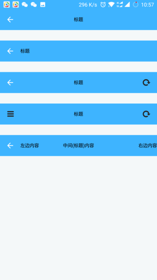

# weiui_navbar

> 导航栏有4个主要部分：返回按钮、左侧、标题和右侧。每个部分可能包含任何内容，但建议按以下方式使用它们：

* 返回按钮部分被设计为“后退链接”。
* 左侧部分被设计为显示在左边的内容（主要用于自定义“后退连接”）。
* 标题部分用于显示页面标题或标签链接（按钮行/分段控制器）。
* 右半部分被设计为显示在右边的内容。

## 子组件

仅支持子组件`<weiui_navbar_item>`详细请看 [这里](component/weiui_navbar_item)

## 预览效果



## 示例代码

```vue
<template>
    <div>

        <!--样式①-->
        <weiui_navbar class="navbar">

            <weiui_navbar_item type="back"></weiui_navbar_item>

            <weiui_navbar_item type="title">
                <text>标题</text>
            </weiui_navbar_item>

        </weiui_navbar>

        <!--样式②-->
        <weiui_navbar class="navbar" :weiui="{titleType:'left'}">

            <weiui_navbar_item type="back"></weiui_navbar_item>

            <weiui_navbar_item type="title">
                <text>标题</text>
            </weiui_navbar_item>

        </weiui_navbar>

        <!--样式③-->
        <weiui_navbar class="navbar">

            <weiui_navbar_item type="back"></weiui_navbar_item>

            <weiui_navbar_item type="title">
                <text>标题</text>
            </weiui_navbar_item>

            <weiui_navbar_item type="right">
                <weiui_icon icon="refresh" class="icon"></weiui_icon>
            </weiui_navbar_item>

        </weiui_navbar>

        <!--样式④-->
        <weiui_navbar class="navbar">

            <weiui_navbar_item type="left">
                <weiui_icon icon="navicon-round" class="icon"></weiui_icon>
            </weiui_navbar_item>

            <weiui_navbar_item type="title">
                <text>标题</text>
            </weiui_navbar_item>

            <weiui_navbar_item type="right">
                <weiui_icon icon="refresh" class="icon"></weiui_icon>
            </weiui_navbar_item>

        </weiui_navbar>

        <!--样式⑤-->
        <weiui_navbar class="navbar">

            <!--返回按钮-->
            <weiui_navbar_item type="back"></weiui_navbar_item>

            <!--左边内容-->
            <weiui_navbar_item type="left">
                <text>左边内容</text>
            </weiui_navbar_item>

            <!--中间内容(标题内容)-->
            <weiui_navbar_item type="title">
                <text>中间(标题)内容</text>
            </weiui_navbar_item>

            <!--右边内容-->
            <weiui_navbar_item type="right">
                <text>右边内容</text>
            </weiui_navbar_item>

        </weiui_navbar>

    </div>
</template>

<style>
    .navbar {
        width: 750px;
        height: 100px;
        margin-bottom: 50px;
    }
    .icon {
        width: 100px;
        height: 100px;
    }
</style>
```


## 配置参数 `weiui`
>说明：ui自定义；数据格式：对象数据。

| 属性名           | 类型     | 描述                          | 默认值     |
| ------------- | ------ | -------------------------- | ------- |
| titleType |`String`  | 标题对齐方式，`left`、`right`、`middle`         | middle       |

> 例如：

```vue
<weiui_navbar 
    ref="reflectName"
    class="navbar" 
    :weiui="{titleType:'left'}"></weiui_navbar>
```

## 事件回调 `callback`

``` js
/**
 * 组件加载完成
 */
@ready = function() { ... }

/**
 * 子组件`<weiui_navbar_item type="back">`的返回事件
 */
@goBack = function() { ... }
```

## 调用方法 `methods`

```js
/**
 * 显示返回按钮
 */
this.$refs.reflectName.showBack();

/**
 * 隐藏返回按钮
 */
this.$refs.reflectName.hideBack();
```


