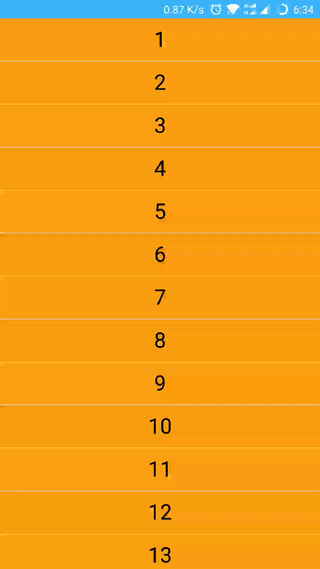

# weiui_recyler

> `<weiui_recyler>`（同等`<weiui_list>`）是一个列表容器，具有回收和复用的能力，可以大幅优化内存占用和渲染性能。

## 子组件

支持包括 `<div>` 在内的任何组件作为自己的子组件。因此，在写一个组件时，推荐外层使用 `<div>` 作为根容器。

## 预览效果



## 示例代码

```vue
<template>
    <div class="box">

        <weiui_recyler
                ref="reflectName"
                class="recyler"
                :weiui="{
                        row: 1,
                        pullTips: true,
                        dividerColor: '#ffffff',
                        dividerHeight: '1',
                    }"
                :swipe="[
                    {
                        text: '选项1',
                        fontSize: '24',
                        padding: '20',
                        color: '#ffff00',
                        backgroundColor: '#ff0000',
                    },{
                        text: '选项2',
                        fontSize: '24',
                        padding: '30',
                        color: '#ecedf0',
                        backgroundColor: '#00ffff',
                    }
                    ]"
                @itemClick="itemClick"
                @itemSwipeClick="itemSwipeClick"
                @pullLoadListener="pullLoadListener"
                @refreshListener="refreshListener">
            <div class="panel" v-for="num in lists">
                <div class="panel-item">
                    <text class="panel-text">{{num}}</text>
                </div>
            </div>
        </weiui_recyler>

    </div>
</template>

<style scoped>
    .box {
        width: 750px;
        flex: 1
    }
    .recyler {
        width: 750px;
        flex: 1
    }
    .panel {
        width: 750px;
        height: 100px;
    }
    .panel-item {
        width: 750px;
        height: 100px;
        background-color: #ff9e14;
        flex-direction: column;
        justify-content: center;
    }
    .panel-text {
        font-size: 50px;
        text-align: center;
    }
</style>

<script>
    const weiui = weex.requireModule('weiui');

    export default {
        data() {
            return {
                lists: [],
            }
        },
        mounted() {
            for (let i = 1; i <= 20; i++) {
                this.lists.push(i);
            }
            this.$refs.reflectName.setHasMore(true);
            //
            setTimeout(() => {
                this.lists.splice(2, 1, "改变第三项文字")
                // splice 详细用法http://www.w3school.com.cn/jsref/jsref_splice.asp
            }, 1000);
        },
        methods: {
            itemClick(params) {
                weiui.toast("点击了" + (params.position + 1) + "项");
            },
            itemSwipeClick(params) {
                weiui.toast("点击了" + (params.position + 1) + "项侧滑的第" + (params.swipePosition + 1) + "个菜单");
            },
            pullLoadListener() {
                let count = this.lists.length;
                if (count >= 100) {
                    this.$refs.reflectName.setHasMore(false);
                    return;
                }
                setTimeout(() => {
                    for (let i = 1; i <= 20; i++) {
                        this.lists.push(count + i);
                    }
                    this.$refs.reflectName.pullloaded();
                    weiui.toast("加载" + (count + 1) + "~" + this.lists.length + "数据成功");
                }, 1000);

            },
            refreshListener() {
                let newList = [];
                for (let i = 1; i <= 20; i++) {
                    newList.push(i);
                }
                setTimeout(() => {
                    this.lists = newList;
                    this.$refs.reflectName.setHasMore(true);
                    this.$refs.reflectName.refreshed();
                    weiui.toast("刷新数据成功");
                }, 1000);

            },
        }
    };
</script>
```


## 配置参数 `weiui`
>说明：ui自定义；数据格式：对象数据。

| 属性名           | 类型     | 描述                          | 默认值     |
| ------------- | ------ | -------------------------- | ------- |
| autoRefresh |`Boolean`  | 初始化自动加载下拉刷新           | false       |
| row |`Number`  | 每行显示列数           | 1       |
| pullTips |`Boolean`  | 是否显示上拉加载更多的提示           | true       |
| pullTipsDefault |`String`  | 上拉加载默认的提示语           | 正在加载数据...       |
| pullTipsLoad |`String`  | 上拉加载正在加载的提示语           | 正在加载更多...       |
| pullTipsNo |`String`  | 上拉加载没有更多的提示语           | 没有更多数据了       |
| dividerColor |`String`  | 行分割线颜色           | #e8e8e8       |
| dividerHeight |`Number`  | 行分割线高度           | 1       |
| itemSpaceTop |`Number`  | 项目边距上           | 0       |
| itemSpaceRight |`Number`  | 项目边距右           | 0       |
| itemSpaceBottom |`Number`  | 项目边距下           | 0       |
| itemSpaceLeft |`Number`  | 项目边距左           | 0       |
| itemBackgroundColor |`String`  | 项目背景颜色           | -       |
| itemDefaultAnimator |`Boolean`  | 打开关闭局部刷新默认动画           | false       |

> 例如：

```vue
<weiui_recyler
    ref="reflectName"
    :weiui="{
        row: 1,
        pullTips: true,
        dividerColor: '#ffffff',
        dividerHeight: '1',
    }"></weiui_navbar>
```

## 配置参数 `swipe`
>说明：项目侧滑菜单；数据格式：数组对象。

| 属性名           | 类型     | 描述                          | 默认值     |
| ------------- | ------ | -------------------------- | ------- |
| width |`Number`、`String`  | 菜单显示宽度           | 0       |
| title |`String`  | 菜单名称           | 按钮1       |
| fontSize |`Number`  | 菜单字体大小           | -       |
| padding |`Number`、`String`  | 菜单内边距           | 0       |
| color |`String`  | 菜单字体颜色           | #000000       |
| backgroundColor |`String`  | 菜单背景颜色           | #ffffff       |

> 例如：

```vue
<weiui_recyler
    ref="reflectName"
    :swipe="[{
        text: '选项1',
        fontSize: '24',
        padding: '20',
        color: '#ffff00',
        backgroundColor: '#ff0000',
    }, {
        text: '选项2',
        fontSize: '24',
        padding: '30',
        color: '#ecedf0',
        backgroundColor: '#00ffff',
    }]"></weiui_navbar>
```

## 事件回调 `callback`

``` js
/**
 * 组件加载完成
 */
@ready = function() { ... }

/**
 * 项目点击事件
 * 返回参数：data = {position: 1}
 */
@itemClick = function(data) { ... }

/**
 * 项目长按事件
 * 返回参数：data = {position: 1}
 */
@itemLongClick = function(data) { ... }

/**
 * 项目侧滑菜单点击事件
 * 返回参数：data = {position: 1, swipePosition: 0,  swipeText: '按钮1'}
 */
@itemSwipeClick = function(data) { ... }

/**
 * 下拉刷新事件
 * 返回参数：data = {realLastPosition: 1, lastVisibleItem: 0}
 */
@refreshListener = function(data) { ... }

/**
 * 上拉加载更多事件
 * 返回参数：data = {realLastPosition: 1, lastVisibleItem: 0}
 */
@pullLoadListener = function(data) { ... }

```

## 调用方法 `methods`

```js
/**
 * 设置下拉刷新状态
 * 参数一：true|false
 */
this.$refs.reflectName.setRefreshing(true);

/**
 * 下拉刷新结束标记
 */
this.$refs.reflectName.refreshed();

/**
 * 设置是否有上拉加载更多的数据
 * 参数一：true|false
 */
 this.$refs.reflectName.setHasMore(true);

/**
 * 上拉加载结束标记
 */
this.$refs.reflectName.pullloaded();

/**
 * 打开关闭局部刷新默认动画
 * 参数一：true|false
 */
this.$refs.reflectName.itemDefaultAnimator(true);

/**
 * 滚动到指定位置
 * 参数一：滚动到的位置，0：顶部、-1：底部
 */
this.$refs.reflectName.scrollToPosition(99);

/**
 * 平滑滚动到指定位置
 * 参数一：滚动到的位置，0：顶部、-1：底部
 */
this.$refs.reflectName.smoothScrollToPosition(99);
```


