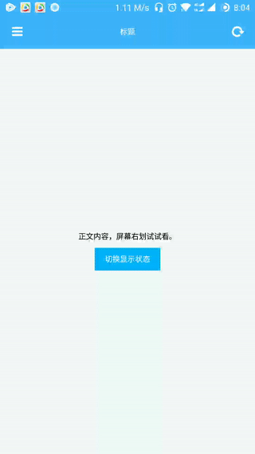

# weiui_side_panel

> `<weiui_side_panel>` 是一个抽屉侧边栏。

## 子组件

支持任何组件作为自己的子组件，其中仅有`<weiui_side_panel_menu>`组件作为侧边菜单详细请看 [这里](component/weiui_side_panel_menu)，其他组件均为正文内容。

## 预览效果



## 示例代码

```vue
<template>
    <div class="app">

        <weiui_side_panel
                ref="reflectName"
                class="side_panel"
                :weiui="{
                        width: '380px',
                        scrollbar: false,
                        backgroundColor: '#26c9ff'
                    }"
                @itemClick="itemClick"
                @switchListener="switchListener">

            <!--侧滑菜单部分-->
            <weiui_side_panel_menu class="panel_menu" name="菜单1">
                <text>菜单①</text>
            </weiui_side_panel_menu>

            <weiui_side_panel_menu class="panel_menu" name="菜单2">
                <text>菜单②</text>
            </weiui_side_panel_menu>

            <!--正文内容部分-->
            <div class="content">
                <!--正文标题栏-->
                <weiui_navbar class="content-navbar">
                    <weiui_navbar_item type="left">
                        <weiui_icon icon="navicon-round" class="content-navbar-icon" @click="menuToggle"></weiui_icon>
                    </weiui_navbar_item>
                    <weiui_navbar_item type="title">
                        <text class="content-navbar-title">标题</text>
                    </weiui_navbar_item>
                    <weiui_navbar_item type="right">
                        <weiui_icon icon="refresh" class="content-navbar-icon"></weiui_icon>
                    </weiui_navbar_item>
                </weiui_navbar>
                <!--正文内容-->
                <scroller class="content-body">
                    <text>正文内容，屏幕右划试试看。</text>
                    <text class="content-body-toggle" @click="menuToggle">切换显示状态</text>
                </scroller>
            </div>

        </weiui_side_panel>

    </div>
</template>

<style scoped>
    .app {
        width: 750px;
        flex: 1;
    }

    .side_panel {
        width: 750px;
        flex: 1;
    }

    .panel_menu {
        width: 380px;
        padding-top: 26px;
        padding-bottom: 26px;
        padding-right: 20px;
        padding-left: 20px;
        border-bottom-width: 1px;
        border-bottom-style: solid;
        border-bottom-color: #ffffff;
    }
    .content {
        width: 750px;
    }
    .content-navbar {
        width: 750px;
        height: 100px;
    }
    .content-navbar-icon {
        width: 100px;
        height: 100px;
        color: #ffffff;
    }
    .content-navbar-title {
        color: #ffffff;
    }
    .content-body {
        flex: 1;
        justify-content: center;
        align-items: center;
    }
    .content-body-toggle {
        text-align: center;
        margin-top: 20px;
        padding-top: 20px;
        padding-bottom: 20px;
        padding-left: 30px;
        padding-right: 30px;
        color: #ffffff;
        background-color: #00B4FF;
    }
</style>

<script>
    const weiui = weex.requireModule('weiui');

    export default {
        methods: {
            itemClick(params) {
                weiui.toast("点击了" + (params.position + 1) + "项，name：" + params.name);
            },
            switchListener(params) {
                weiui.toast("侧边栏：" + (params.show?"显示了":"隐藏了"));
            },
            menuToggle() {
                this.$refs.reflectName.menuToggle();
            },
        }
    };
</script>
```


## 配置参数 `weiui`
>说明：ui自定义；数据格式：对象数据。

| 属性名           | 类型     | 描述                          | 默认值     |
| ------------- | ------ | -------------------------- | ------- |
| width |`Number`  | 侧边栏的宽度           | 380       |
| scrollbar |`Boolean`  | 侧边栏是否显示滚动条           | false       |
| backgroundColor |`String`  | 侧边栏的背景颜色           | #ffffff       |

> 例如：

```vue
<weiui_side_panel
    ref="reflectName"
    :weiui="{
        width: '380px',
        scrollbar: false,
        backgroundColor: '#26c9ff'
    }"></weiui_side_panel>
```

## 事件回调 `callback`

``` js
/**
 * 组件加载完成
 */
@ready = function() { ... }

/**
 * 侧边栏项目点击事件
 * 返回参数：data = {name: 'pageName', position: 1}
 */
@itemClick = function(data) { ... }

/**
 * 侧边栏项目长按事件
 * 返回参数：data = {name: 'pageName', position: 1}
 */
@itemLongClick = function(data) { ... }

/**
 * 侧边栏状态改变事件
 * 返回参数：data = {show: true}
 */
@switchListener = function(data) { ... }
```

## 调用方法 `methods`

```js
/**
 * 显示侧边栏
 */
this.$refs.reflectName.menuShow();

/**
 * 隐藏侧边栏
 */
this.$refs.reflectName.menuHide();

/**
 * 切换侧边栏显示/隐藏
 */
this.$refs.reflectName.menuToggle();

/**
 * 获取侧边栏是否显示
 * 返回参数：true|false
 */
 this.$refs.reflectName.getMenuShow();

/**
 * 设置侧边栏的宽度
 * 参数一：宽度
 */
this.$refs.reflectName.setMenuWidth(380);

/**
 * 设置侧边栏是否显示滚动条
 * 参数一：true|false
 */
this.$refs.reflectName.setMenuScrollbar(true);

/**
 * 设置侧边栏的背景颜色
 * 参数一：颜色代码
 */
this.$refs.reflectName.setMenuBackgroundColor('#0000ff');
```


