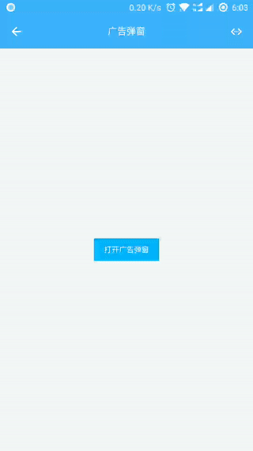

# 广告弹窗

> 需要的模块

```js
const weiui = weex.requireModule('weiui');
```

## weiui.adDialog

> 图片广告弹窗

### 预览效果



```js
/**
 * @param params    详细参数
 * @param callback  回调事件
 */
weiui.adDialog({params}, callback(result))
```

### params 参数说明

| 属性名 | 类型 | 必须 | 描述 | 默认值 |
| --- | --- | :-: | --- | --- |
| imgUrl | `String` | √ | 图片地址 | - |
| width | `Number` | - | 弹出图片宽度，留空自动 | - |
| height | `Number` | - | 弹出图片高度，留空自动 | - |
| showClose | `Boolean` | - | 是否显示关闭按钮 | true |
| backClose | `Boolean` | - | 是否允许按返回键关闭 | true |
| dialogName | `String` | - | 弹窗名称，用于手动关闭指定弹窗 | - |

* `width`、`height` 两个只赋值一个时，另一个参数自动等比缩放

### callback 回调`result`说明

```js
{
    status: 'click',      //状态，详见：注①
    dialogName: 'dialogName',    //弹窗名称
    imgUrl: 'http://....',     //弹窗图片地址
}
```

> 注①：

- `load`图片加载中
- `ready`就绪
- `show`显示
- `click`点击弹窗图片
- `destroy`已销毁

### 简单示例

```js
//示例①
weiui.adDialog({
    imgUrl: "http://..../xxx.png",
    backClose: false
}, (res) => {
    weiui.toast("状态：" + res.status);
});

//示例②
weiui.adDialog("http://..../xxx.png", (res) => {
    weiui.toast("状态：" + res.status);
});
```

## weiui.adDialogClose

> 手动关闭弹窗

```js
/**
 * @param dialogName    弹窗名称（留空则关闭第一个弹窗）
 */
weiui.adDialogClose(dialogName)
```


