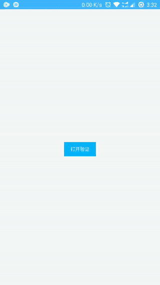

#### 需要的模块

```js
const weiui = weex.requireModule('weiui');
```

# weiui.swipeCaptcha

> 显示滑动验证码弹窗

```js
/**
 * @param imgUrl    自定义显示的图片
 * @param callback  回调事件
 */
weiui.swipeCaptcha(imgUrl, callback(result))
```

#### 预览效果




#### 示例代码

```vue
<template>
    <div class="app">

        <text class="button" @click="swipeCaptcha">打开验证</text>

    </div>
</template>

<style>
    .app {
        flex: 1;
        justify-content: center;
        align-items: center;
    }
    .button {
        text-align: center;
        margin-top: 20px;
        padding-top: 20px;
        padding-bottom: 20px;
        padding-left: 30px;
        padding-right: 30px;
        color: #ffffff;
        background-color: #00B4FF;
    }
</style>

<script>
    const weiui = weex.requireModule('weiui');

    export default {
        methods: {
            swipeCaptcha() {
                weiui.swipeCaptcha(null, (res)=>{
                    switch (res.status) {
                        case "success":
                            weiui.toast("验证成功");
                            break;

                        case "failed":
                            weiui.toast("验证失败");
                            break;
                    }
                });
            },
        }
    };
</script>
```

#### imgUrl 参数说明

| 类型 | 必须 | 描述 | 默认值 |
| --- | :-: | --- | --- |
| `String` | - | 自定义显示的图片 | - |

#### callback 回调`result`说明

```js
{
    pageName: '页面名称',
    status: 'create',   //状态，详见：注①
}
```

###### 注①：
- `create`页面创建完毕
- `destroy`页面已销毁
- `success`验证成功
- `failed`验证失败

#### 简单示例

```js
//示例①
weiui.swipeCaptcha(null, function(result) {
    //......
});

//示例②
weiui.swipeCaptcha('http://...../captcha.png', function(result) {
    //......
});
```

