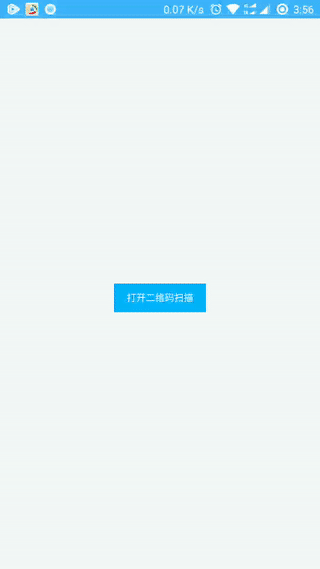

# 二维码扫描

> 需要的模块

```js
const weiui = weex.requireModule('weiui');
```

## weiui.openScaner

> 二维码扫描页面

### 预览效果



```js
/**
 * @param params    详细参数
 * @param callback  回调事件
 */
weiui.openScaner({params}, callback(result))
```

### 示例代码

```vue
<template>
    <div class="app">

        <text class="button" @click="openScaner">打开二维码扫描</text>

    </div>
</template>

<style>
    .app {
        flex: 1;
        justify-content: center;
        align-items: center;
    }
    .button {
        text-align: center;
        margin-top: 20px;
        padding-top: 20px;
        padding-bottom: 20px;
        padding-left: 30px;
        padding-right: 30px;
        color: #ffffff;
        background-color: #00B4FF;
    }
</style>

<script>
    const weiui = weex.requireModule('weiui');

    export default {
        methods: {
            openScaner() {
                weiui.openScaner(null, (res)=>{
                    switch (res.status) {
                        case "success":
                            weiui.toast("识别成功：" + res.text);
                            break;

                        case "failed":
                            weiui.toast("识别失败");
                            break;
                    }
                });
            },
        }
    };
</script>
```

### params 参数说明

| 属性名 | 类型 | 必须 | 描述 | 默认值 |
| --- | --- | :-: | --- | --- |
| desc | `String` | - | 描述文字 | 将二维码图片对准扫描框即可自动扫描 |
| successClose | `Boolean` | - | 扫描成功过自动关闭页面 | true |


### callback 回调`result`说明

```js
{
    pageName: '页面名称',
    status: 'create',   //状态，详见：注①
    
    //status=success
    source: 'photo',    //扫码识别来源，photo：照片、camera：相机
    result: { ... },    //扫码识别详细数据
    format: 'CODE_128', //扫码识别的类型
    text: 'http://...', //扫码识别内容
    
    //status=error
    source: 'photo',    //扫码失败来源，photo：照片、camera：相机
}
```

> 注①：

- `create`页面创建完毕
- `destroy`页面已销毁
- `success`扫码识别成功
- `error`扫码识别失败
- `changeQr`切换二维码扫描
- `changeBar`切换条形码扫描
- `openLight`打开闪光灯
- `offLight`关闭闪光灯

### 简单示例

```js
//示例①
weiui.openScaner(null, function(result) {
    //......
});

//示例②
weiui.openScaner({
    desc: '对准中间就开始扫吧',
}, function(result) {
    //......
});
```

