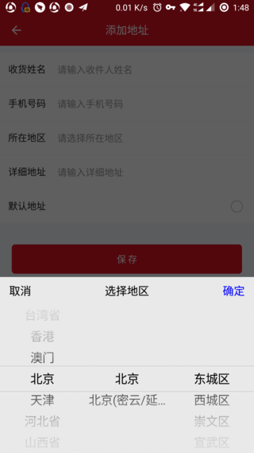

# 接入使用

## 简介

fork from [https://github.com/crazyandcoder/citypicker](https://github.com/crazyandcoder/citypicker)

一款针对android平台下的城市选择器

## Android 接入

###  1.添加 Gradle 依赖

[](https://bintray.com/kuaifan/maven/weiui_citypicker/_latestVersion) weiui_citypicker 后面的「latestVersion」指的是左边这个 Download 徽章后面的「数字」，请自行替换。

```groovy
dependencies {
    ......
    implementation 'vip.kuaifan:weiui_citypicker:latestVersion'
}
```

使用到的依赖库

```groovy
dependencies {
    ......
    implementation "com.google.code.gson:gson:2.8.2"
}
```

###  2.在 Application 的 onCreate 方法中初始化工程

```js
public class App extends Application {

    @Override
    public void onCreate() {
        super.onCreate();

        weiui.init(this);
        
        /**
        * 在【weiui.init】之后执行初始化工程
        */
        weiui_citypicker.init();
    }
}
```
## iOS 接入
> 暂不支持iOS系统

## 预览效果



## 示例代码

```vue
<template>
    <div class="app">

        <text class="button" @click="citypicker">选择城市</text>
        <text>{{province}} {{city}} {{area}}</text>

    </div>
</template>

<style>
    .app {
        flex: 1;
        justify-content: center;
        align-items: center;
    }
    .button {
        text-align: center;
        margin-top: 20px;
        padding-top: 20px;
        padding-bottom: 20px;
        padding-left: 30px;
        padding-right: 30px;
        color: #ffffff;
        background-color: #00B4FF;
    }
</style>

<script>
    const weiui_citypicker = weex.requireModule('weiui_citypicker');

    export default {
        data() {
            return {
                province: '浙江省',
                city: '杭州',
                area: '市辖区'
            }
        },
        methods: {
            citypicker() {
                weiui_citypicker.select({
                    province: this.province,
                    city: this.city,
                    area: this.area
                }, (result) => {
                    this.province = result.province;
                    this.city = result.city;
                    this.area = result.area;
                });
            }
        }
    };
</script>
```
