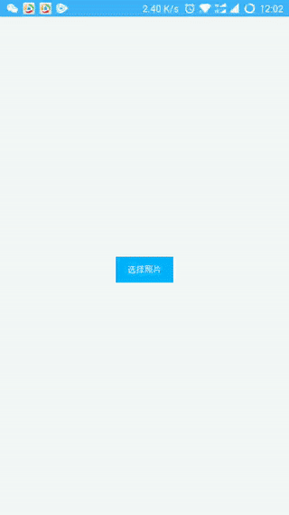

# 安装接入示例

## 简介

fork from [https://github.com/LuckSiege/PictureSelector](https://github.com/LuckSiege/PictureSelector)

一款针对android平台下的图片选择器，支持从相册或拍照选择图片或视频、音频，支持动态权限获取、裁剪(单图or多图裁剪)、压缩、主题自定义配置等功能、适配android 6.0+系统的开源图片选择框架。

## Android 接入

> 集成，添加 Gradle 依赖

[](https://bintray.com/kuaifan/maven/weiui_picture/_latestVersion) weiui_picture 后面的「latestVersion」指的是左边这个 Download 徽章后面的「数字」，请自行替换。

```groovy
dependencies {
    ......
    implementation 'vip.kuaifan:weiui_picture:latestVersion'
}
```

使用的依赖库

```groovy
dependencies {
    ......
    implementation "io.reactivex.rxjava2:rxjava:2.0.5"
    implementation "io.reactivex.rxjava2:rxandroid:2.0.1"
    implementation 'vip.kuaifan:weiui_picture_ucrop:latestVersion'
}
```

### 预览效果



### 示例代码

```vue
<template>
    <div class="app">

        <weiui_list v-if="lists.length > 0"
                    :style="{width:'750px', height: (Math.ceil(lists.length / 5) * 150) + 'px'}"
                    :weiui="{row:5,pullTips:false}">
            <div v-for="(item, position) in lists" class="imgbox" @click="pictureView(position)">
                <image :src="'file://' + item.path" class="image" resize="cover" ></image>
            </div>
        </weiui_list>

        <text class="button" @click="openPicture">选择照片</text>
        <text v-if="lists.length > 0" class="button2" @click="lists=[]">清空选择</text>

    </div>
</template>

<style>
    .app {
        flex: 1;
        justify-content: center;
        align-items: center;
    }
    .imgbox {
        width: 150px;
        height: 150px;
    }
    .image {
        width: 130px;
        height: 130px;
        margin-top: 10px;
        margin-bottom: 10px;
        margin-right: 10px;
        margin-left: 10px;
    }
    .button {
        text-align: center;
        margin-top: 20px;
        padding-top: 20px;
        padding-bottom: 20px;
        padding-left: 30px;
        padding-right: 30px;
        color: #ffffff;
        background-color: #00B4FF;
    }
    .button2 {
        margin-top: 20px;
        color: #00B4FF;
        border-bottom-width: 1px;
        border-bottom-style: solid;
        border-bottom-color: #ff9b39;
    }
</style>

<script>
    const weiui_picture = weex.requireModule('weiui_picture');

    export default {
        data() {
            return {
                lists: []
            }
        },
        methods: {
            openPicture() {
                weiui_picture.create({
                    gallery: 1,
                    selected: this.lists
                }, (result) => {
                    console.log("aaaaaaaaaa", result);
                    if (result.status == "success") {
                        this.lists = result.lists;
                    }
                });
            },
            pictureView(position) {
                weiui_picture.picturePreview(position, this.lists);
            }
        }
    };
</script>
```

## iOS 接入
> 暂不支持iOS系统

## H5 接入
> 暂不支持H5系统
