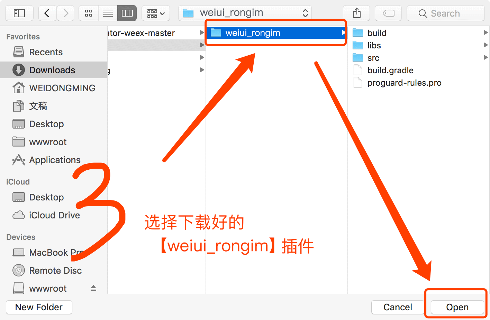
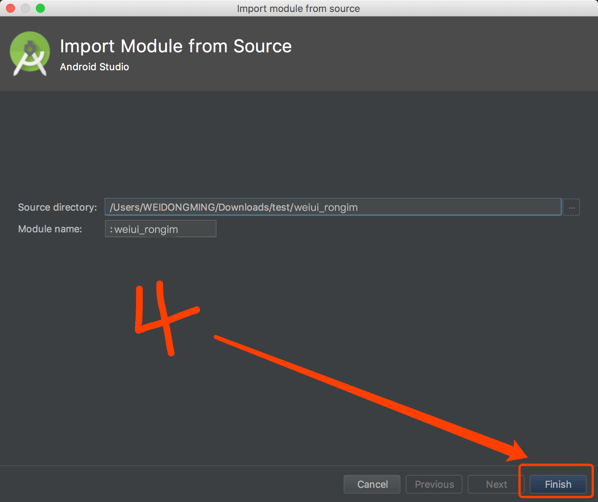
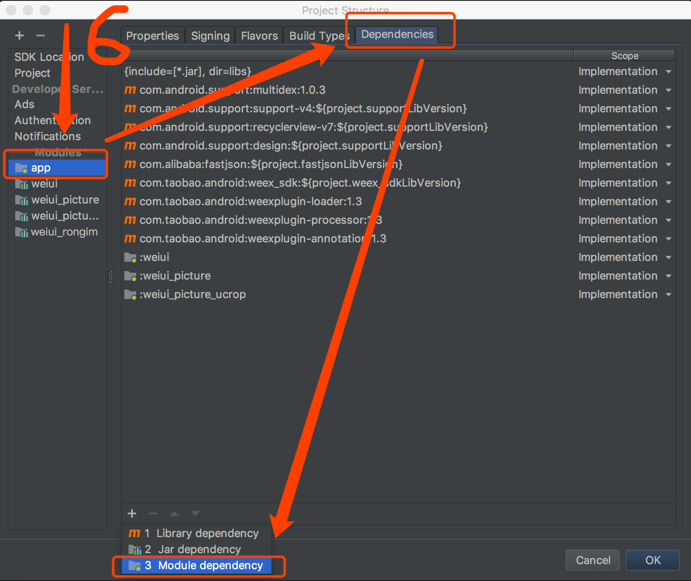
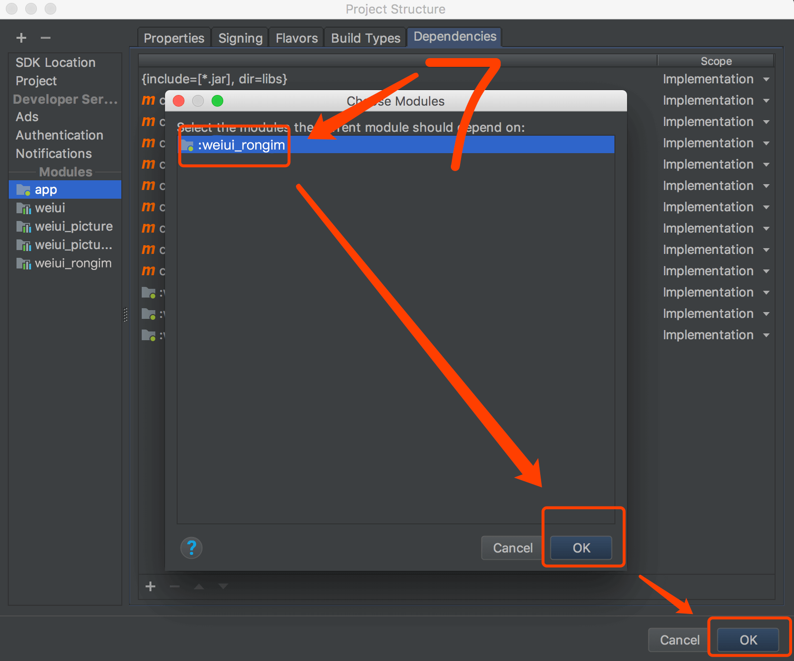

# 安装接入

## 简介

融云通讯能力库 - IMLib

## Android 接入

### 1、下载SDK

SDK已上传至github，[https://github.com/kuaifan/weiui](https://github.com/kuaifan/weiui)，`weiui_rongim`SDK路径为：library/weiui_rongim

### 2、导入SDK









### 3、初始化SDK

> 在 Application 的 onCreate 方法中初始化工程

```js
public class App extends Application {

    @Override
    public void onCreate() {
        super.onCreate();

        weiui.init(this);
        
        /**
         * 在【weiui.init】之后执行初始化工程
         * 第一个参数：融云注册应用的AppKey
         * 第一个参数：融云注册应用的AppSecret
         */
        weiui_rongim.init(String appKey, String appSecret);
    }
}
```

## iOS 接入
> 暂不支持iOS系统


