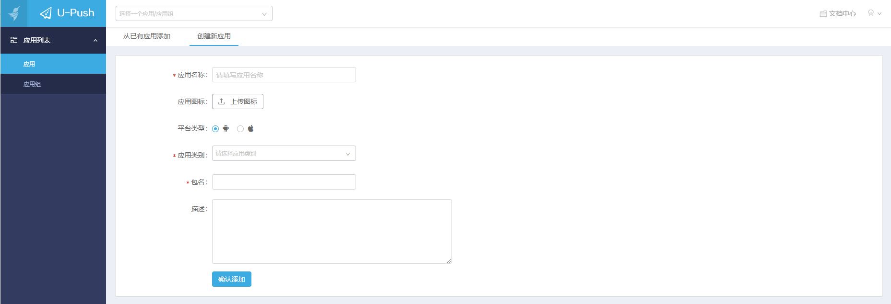
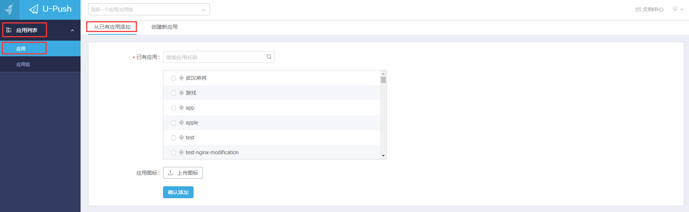
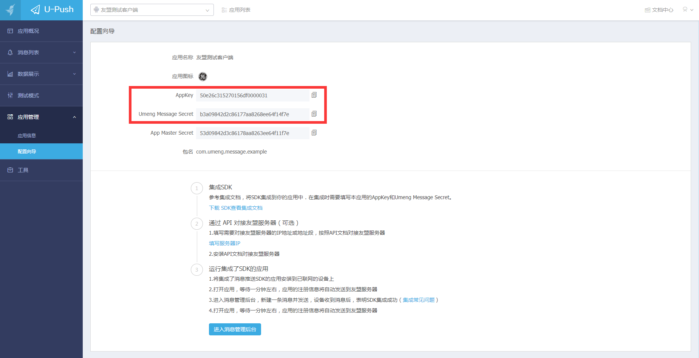

## 创建友盟推送应用

1. 请在 `http://message.umeng.com/`上使用你的应用包名创建应用（注：Android Studio请使用applicationId作为包名）。

    

2. Appkey作为【友盟+】对应用的唯一标识，在【友盟+】推送和【友盟+】统计，都是可以使用同一个的。已经使用了【友盟+】统计的用户，请从【友盟+】后台已有应用中添加。

    

3. 获取应用对应的AppKey和Umeng Message Secret，如下图：

    

