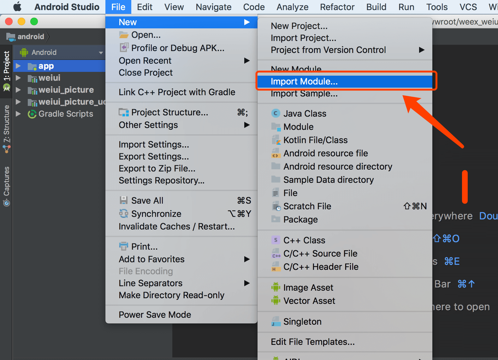
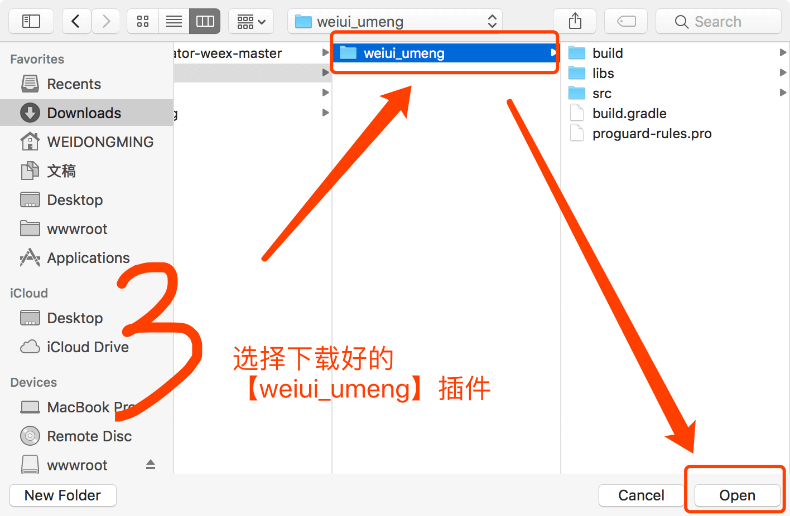
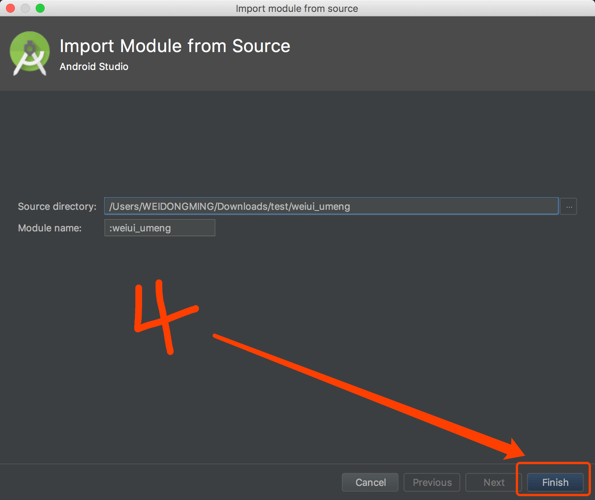
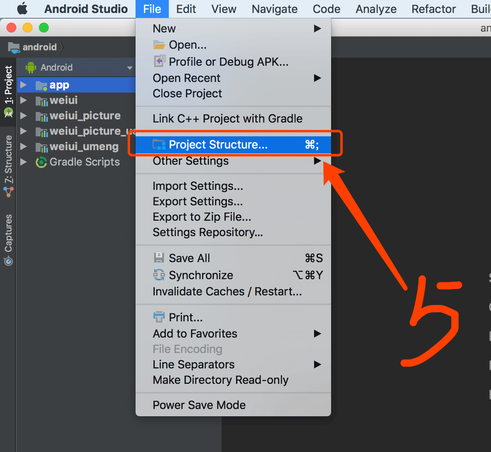
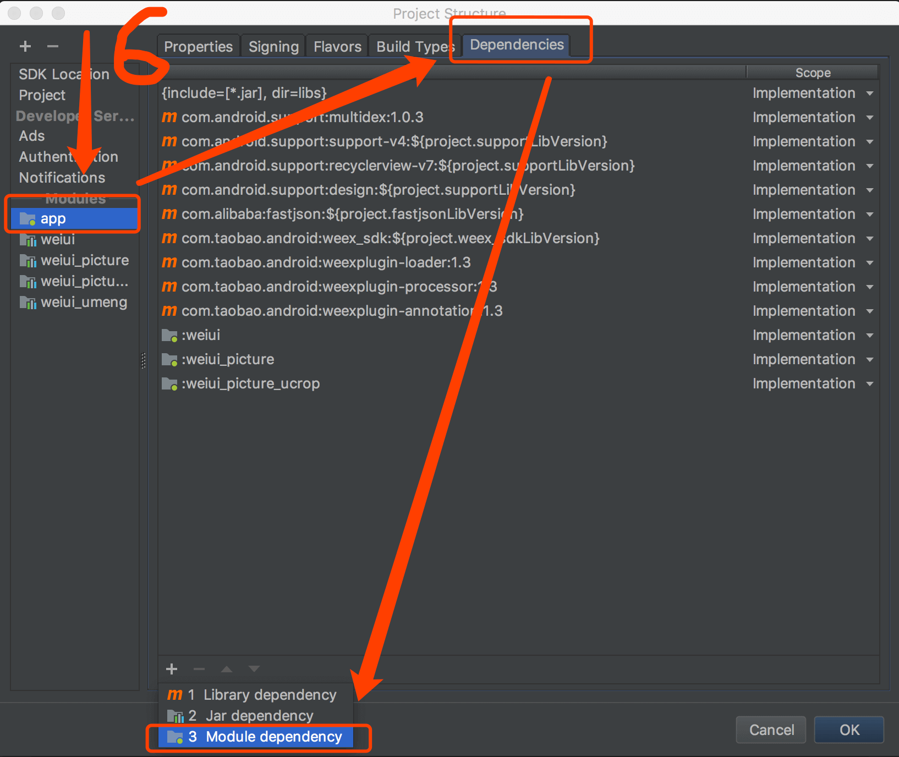
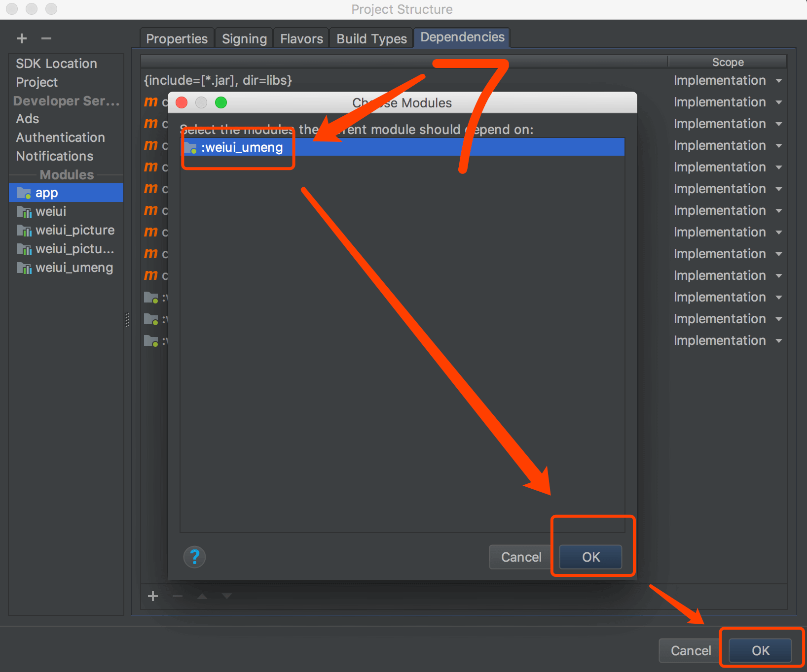

# 安装接入

## 简介

友盟推送、统计模块

## Android 接入

### 1、下载SDK

SDK已上传至github，[https://github.com/kuaifan/weiui](https://github.com/kuaifan/weiui)，`weiui_umeng`SDK路径为：library/weiui_umeng

### 2、导入SDK










### 3、初始化SDK

> 必须在 Application 的 onCreate 方法中执行 weiui_umeng.init 来初始化工程

```js
public class App extends Application {

    @Override
    public void onCreate() {
        super.onCreate();
    
        weiui.init(this);
        
         /**
         * 必须在【weiui.init】之后执行 weiui_umeng.init 来初始化工程
         * 第一个参数：友盟 app key
         * 第一个参数：友盟 Push推送业务的secret
         * 第三个参数：友盟 channel（可留空）
         */
        weiui_umeng.init(String key, String secret, String channel);
        
    }
}
```


