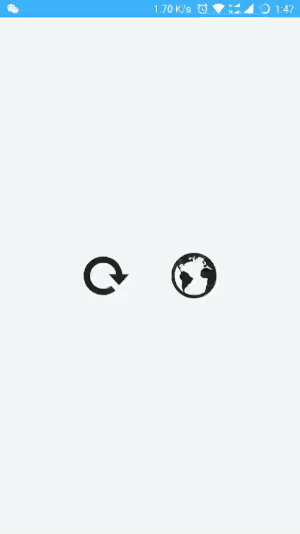

# Android 接入

> 注意对版本的要求如下（>=）：

* minSdkVersion  = 18
* targetSdkVersion = 27
* supportLibVersion = 27.1.0

## 集成方式

### 1.添加 Gradle 依赖
[](https://bintray.com/kuaifan/maven/weiui/_latestVersion) weiui 后面的「latestVersion」指的是左边这个 Download 徽章后面的「数字」，请自行替换。

```groovy
dependencies {
    ......
    implementation 'vip.kuaifan:weiui:latestVersion'
}
```

以下是使用到的依赖库
```groovy
dependencies {
    ......
    // 依赖库（换成己工程里依赖的版本）
    implementation 'com.android.support:support-v4:27.1.0'
    implementation 'com.android.support:design:27.1.0'
    implementation 'com.taobao.android:weex_sdk:0.18.0'
    implementation 'org.weex.plugin:processor:1.0.2'
}
```

### 2.必须在 Application 的 onCreate 方法中执行 weiui.init 来初始化工程

```java
public class App extends Application {

    @Override
    public void onCreate() {
        super.onCreate();
        
        /**
         * ① 必须在 Application 的 onCreate 方法中执行 weiui.init 来初始化工程
         * 第一个参数：应用程序上下文
         */
        weiui.init(this);
        
         /**
         * ② 这个也是必须的，加载当前应用中集成的所有插件
         */
        WeexPluginContainer.loadAll(this);
    }
}
```
## 使用

```vue
<template>
    <div class="box">

        <weiui_icon class="icon"
                    :weiui="{
                        text: 'refresh',
                        textSize: '50',
                        textClickColor: '#ff0000'
                    }"
                    @click="iconClicked"></weiui_icon>
        <weiui_icon class="icon"
                    text="earth"
                    textSize="50"
                    textClickColor="#00ff00"
                    @click="iconClicked2"></weiui_icon>

    </div>
</template>

<style>
    .box {
        flex: 1;
        flex-direction: row;
        justify-content: center;
        align-items: center;
    }
    .icon {
        width: 200px;
        height: 200px;
        margin-left: 10px;
        margin-right: 10px;
    }
</style>

<script>
    const weiui = weex.requireModule('weiui');

    module.exports = {
        methods: {
            iconClicked() {
                weiui.loading({
                    title: '正在加载...',
                    style: 'rotatingplane',
                    duration: 3000
                });
            },
            iconClicked2() {
                weiui.openWeb("http://kuaifan.vip");
            },
        }
    };
</script>
```

### 使用效果




# iOS 接入
> `weiui` 暂不支持iOS系统

# H5 接入
> `weiui` 暂不支持H5系统


